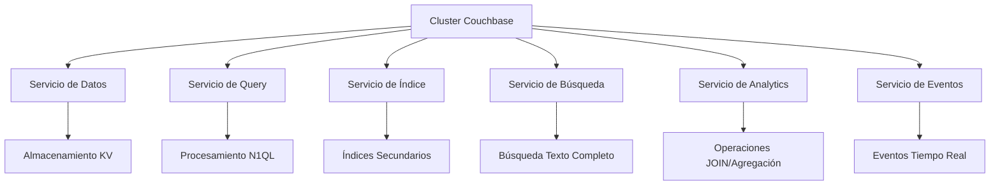
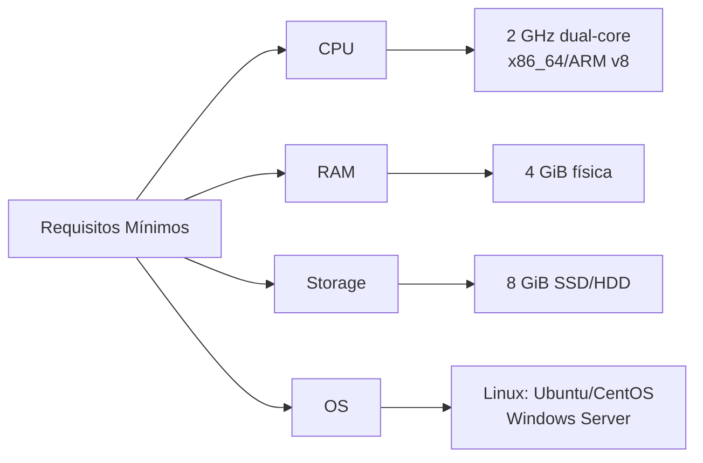
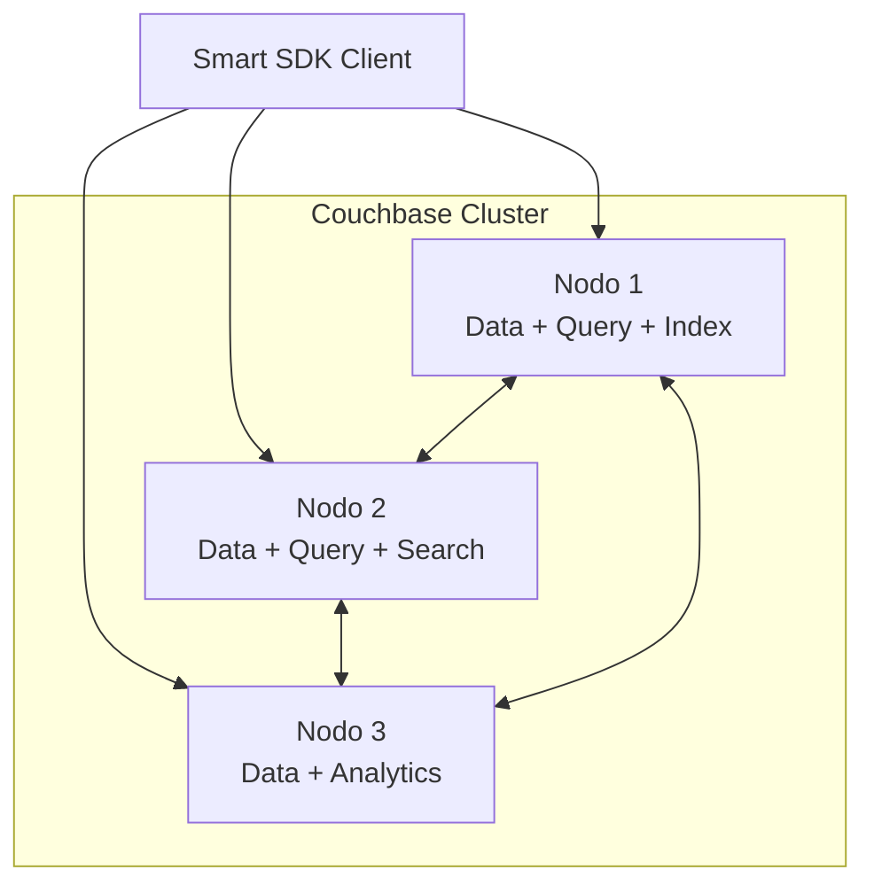
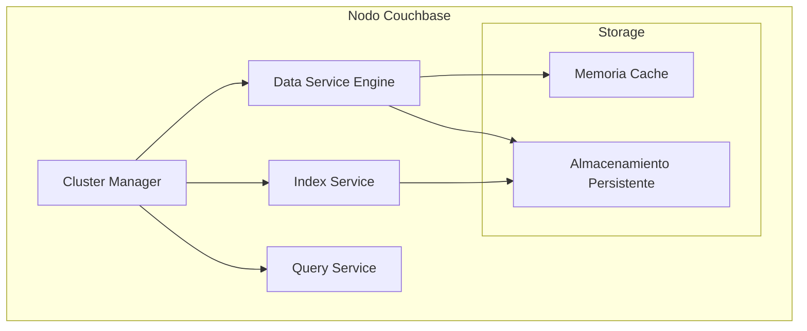
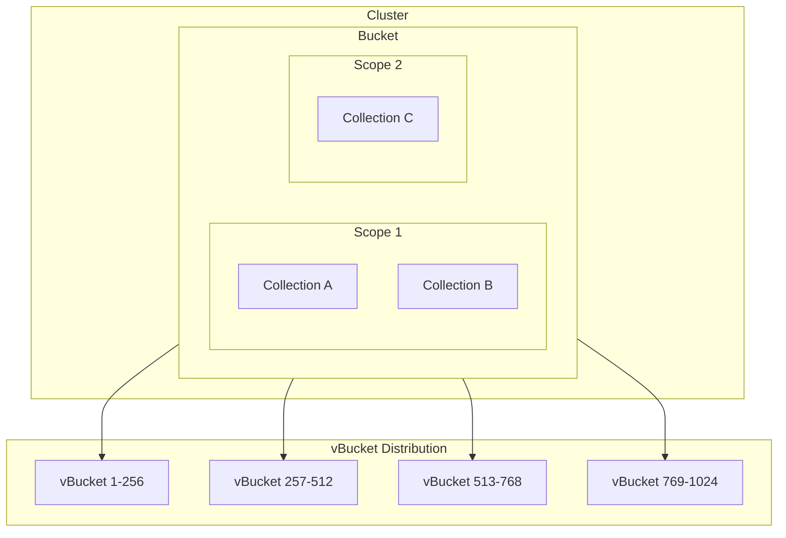

# PRESENTACIÓN: MANEJADOR DE BASE DE DATOS - COUCHBASE

---

## Slide 1: Introducción
### ¿Qué es Couchbase?

**Couchbase** es un sistema de gestión de bases de datos NoSQL distribuido y orientado a documentos

- **Fusión innovadora**: Membase (clave-valor) + CouchDB (documentos) = **Couchbase (2011)**
- **Arquitectura memory-first** para alto rendimiento
- **Esquema flexible** para datos no estructurados/semi-estructurados
- **Diseñado para aplicaciones modernas** que requieren velocidad y escalabilidad

---

## Slide 2: Características Principales I
### Arquitectura y Rendimiento

🏗️ **Arquitectura NoSQL Distribuida**
- Múltiples nodos/servidores para alta disponibilidad
- Tolerancia a fallos automática

⚡ **Memory-First Design**
- Datos almacenados inicialmente en memoria
- Persistencia automática a disco
- Latencias sub-milisegundo

🔍 **Lenguaje N1QL**
- Consultas tipo SQL para documentos JSON
- Familiar para desarrolladores SQL

---

## Slide 3: Características Principales II
### Servicios y Funcionalidades

🔎 **Búsqueda de Texto Completo**
- Búsquedas complejas en documentos JSON
- Consciente del idioma

🌐 **Replicación Cross-Datacenter (XDCR)**
- Datos entre múltiples centros de datos
- Recuperación ante desastres

⚡ **Caching Integrado**
- Sin necesidad de capa externa de cache
- Reducción significativa de latencia

🔒 **Transacciones ACID**
- Atomicidad, Consistencia, Aislamiento, Durabilidad

---

## Slide 4: Servicios Especializados
### Multi-Dimensional Scaling (MDS)



**Escalado independiente** de cada servicio según necesidades

---

## Slide 5: Casos de Uso Recomendados I
### E-commerce y Aplicaciones Web

🛒 **E-commerce**
- Gestión de inventario en tiempo real
- Catálogos de productos flexibles
- Carritos de compra y sesiones de usuario

📱 **Redes Sociales** 
- Perfiles de usuarios y contenido dinámico
- Feeds en tiempo real
- Búsqueda de contenido avanzada

🔐 **Gestión de Sesiones**
- Almacenamiento de tokens y sesiones
- Escalabilidad automática

---

## Slide 6: Casos de Uso Recomendados II
### Mobile y IoT

📱 **Aplicaciones Móviles Offline-First**
- Sincronización automática cuando hay conectividad
- Funcionalidad completa sin internet
- Couchbase Lite para dispositivos

🌐 **Internet de las Cosas (IoT)**
- Procesamiento edge computing
- Grandes volúmenes de datos de sensores
- Análisis en tiempo real

🎮 **Gaming Móvil**
- Experiencia de juego sin interrupciones
- Sincronización entre dispositivos

---

## Slide 7: Casos de Uso por Industrias

| Industria | Aplicación | Beneficio |
|-----------|------------|-----------|
| **Seguros** | Ajustes de reclamaciones | Trabajo offline en áreas sin conectividad |
| **Salud** | Monitoreo de pacientes | Diagnóstico en tiempo real |
| **Servicios Públicos** | Inspecciones de campo | Apps funcionan en ubicaciones remotas |
| **Ciudades Inteligentes** | Videovigilancia, tráfico | Procesamiento local de datos |
| **Restaurantes** | Pedidos móviles | Sin dependencia de conectividad |

---

## Slide 8: Limitaciones Técnicas I
### Restricciones de Memoria y Conexiones

⚠️ **Limitación de Memoria**
- Todas las claves deben residir en memoria
- Requiere planificación cuidadosa de RAM en el clúster

🔌 **Límites de Conexión**
- **60,000 conexiones** concurrentes por nodo (clave-valor)
- **Consultas N1QL**: 4 × núcleos (CE) o núcleos (EE)

📄 **Tamaño de Documentos**
- Límite de **20MB por documento**
- Puede ser restrictivo para archivos multimedia

---

## Slide 9: Limitaciones Técnicas II
### Rendimiento y Consistencia

⚖️ **Consistencia Eventual**
- En configuraciones multi-datacenter (XDCR)
- Prioriza disponibilidad sobre consistencia inmediata

📈 **Degradación con Documentos Grandes**
- Descompresión requerida para operaciones
- Procesamiento secuencial de sub-consultas

🛠️ **Complejidad de Configuración**
- Requiere experiencia para optimización
- Configuración de índices y memoria

---

## Slide 10: Capacidad de Usuarios
### Escalabilidad y Rendimiento

📊 **Conexiones por Nodo**
```
Clave-Valor: 60,000 conexiones concurrentes
N1QL Queries: 4 × núcleos (CE) | núcleos × 16 (EE)
Cola: 256 × CPUs lógicas
```

🔄 **Escalabilidad Horizontal**
- 3 nodos = **180,000 conexiones** clave-valor
- Prácticamente **ilimitado** agregando nodos

⚡ **Casos Reales**
- **Amadeus**: 20M operaciones/segundo, <2.5ms respuesta
- **Tesco**: 35,000 solicitudes/segundo, 10M productos
- **Carrefour**: 20,000 ops/seg con picos 4x normales

---

## Slide 11: Requisitos Mínimos
### Hardware y Sistema Operativo



**Sistemas Operativos Soportados:**
- Linux: Ubuntu 20.04+, CentOS 7+, Amazon Linux
- Windows: Server 2012/2016/2019

---

## Slide 12: Requerimientos Técnicos
### Configuraciones Recomendadas

| Componente | Mínimo | Recomendado | Producción |
|------------|--------|-------------|------------|
| **CPU** | 2 GHz dual-core | 3 GHz quad-core | 3 GHz six-core + XDCR |
| **RAM** | 4 GiB | 16 GiB | 32+ GiB |
| **Storage** | 8 GiB HDD | 16 GiB SSD | SSD + RAID |
| **Red** | 1 Gbps | 10 Gbps | 10+ Gbps |

**Consideraciones:**
- Asignar **60-80% RAM** a Couchbase
- **SSD recomendado** para mejor rendimiento
- **XFS filesystem** preferido en Linux

---

## Slide 13: Configuración del Sistema
### Optimizaciones de SO

🐧 **Linux Optimizations**
```bash
# Deshabilitar Transparent Huge Pages
echo never > /sys/kernel/mm/transparent_hugepage/enabled

# Configurar swappiness
sysctl vm.swappiness=0

# Filesystem recomendado
mkfs.xfs /dev/device
```

🕒 **Sincronización de Tiempo**
```bash
# Configurar NTP
systemctl enable ntp
systemctl start ntp
```

🔥 **Firewall Ports**
- **8091**: Consola Web
- **11210-11211**: Servicios de datos
- **8092-8096**: Servicios adicionales

---

## Slide 14: Arquitectura del Entorno I
### Topología de Clúster



**Características:**
- **Peer-to-peer**: Todos los nodos son iguales
- **Sin SPOF**: No hay puntos únicos de fallo
- **Auto-discovery**: SDK conoce topología automáticamente

---

## Slide 15: Arquitectura del Entorno II  
### Componentes del Nodo



**Funciones:**
- **Cluster Manager**: Coordinación y configuración
- **Data Service**: Almacenamiento y recuperación
- **Index/Query**: Procesamiento de consultas

---

## Slide 16: Modelos de Despliegue
### Opciones de Infraestructura

| Modelo | Ventajas | Consideraciones |
|--------|----------|----------------|
| **On-Premises** | Control completo, seguridad | Mantenimiento, escalabilidad |
| **Cloud (IaaS)** | Escalabilidad, flexibilidad | Costos, dependencia de proveedor |
| **Capella (DBaaS)** | Totalmente gestionado | Menor control, costos predecibles |
| **Híbrido** | Mejor de ambos mundos | Complejidad de gestión |

🐳 **Contenedores**
- **Docker**: Desarrollo y testing
- **Kubernetes**: Producción con Operator

---

## Slide 17: Gestión de Datos
### Organización y Distribución



**Conceptos Clave:**
- **1024 vBuckets** para distribución uniforme
- **Hash-based sharding** automático
- **Réplicas configurables** hasta 3

---

## Slide 18: Operaciones del Clúster
### Mantenimiento y Escalabilidad

🔄 **Rebalanceo**
- Redistribución automática de datos
- **Sin tiempo de inactividad**
- Monitoreo del progreso en tiempo real

⚠️ **Failover**
- Detección automática de fallas
- Promoción de réplicas
- Recuperación de nodos

🗜️ **Compactación**
- Limpieza automática de espacio fragmentado
- Minimización de impacto en operaciones
- Programable por horarios

---

## Slide 19: Seguridad y Monitoreo
### Administración del Entorno

🔐 **Seguridad Multi-Capa**
- **RBAC**: Control granular de acceso
- **LDAP/AD**: Integración empresarial  
- **TLS**: Encriptación en tránsito
- **Encryption at rest**: Datos protegidos

📊 **Herramientas de Administración**
- **Web Console**: Interface gráfica completa
- **REST APIs**: Automatización y integración
- **CLI Tools**: Administración por scripts
- **Métricas**: Prometheus/Grafana integration

---

## Slide 20: Ventajas Competitivas
### ¿Por qué elegir Couchbase?

✅ **Ventajas Clave**
- **Memory-first** sin cache externo
- **SQL familiar** (N1QL) en NoSQL  
- **Escalabilidad lineal** sin límites teóricos
- **Multi-model**: KV + Documento + Search + Analytics
- **Offline-first** con Couchbase Mobile
- **Cloud-native** con auto-scaling

🎯 **Diferenciadores**
- **Workload isolation** con MDS
- **ACID transactions** distribuidas  
- **Cross-datacenter** replication
- **Developer productivity** con SDKs inteligentes

---

## Slide 21: Casos de Éxito
### Empresas que Confían en Couchbase

| Empresa | Caso de Uso | Métricas |
|---------|-------------|----------|
| **Amadeus** | Reservas de viaje | 20M ops/seg, 180TB datos |
| **Tesco** | E-commerce retail | 10M productos, 35K req/seg |
| **Carnival** | Ocean Medallion | Análisis tiempo real |
| **FICO** | Detección de fraude | <1ms respuesta, 24x7 uptime |
| **Coyote** | Logística | 500M documentos |

💡 **Impacto Empresarial**
- **60% reducción** costos operativos
- **50% mejora** en rendimiento
- **99.999% disponibilidad**

---

## Slide 22: Roadmap y Futuro
### Innovaciones y Tendencias

🤖 **AI/ML Integration**
- **Vector search** nativo
- **Feature stores** online/offline
- **RAG applications** con LLMs
- **Semantic search** avanzado

☁️ **Cloud-Native Evolution**  
- **Kubernetes-first** deployment
- **Serverless** capabilities
- **Multi-cloud** flexibility
- **Auto-scaling** inteligente

📈 **Performance Innovations**
- **Plasma storage** engine
- **Magma** for cost efficiency
- **Columnar analytics** 100x faster

---

## Slide 23: Mejores Prácticas
### Recommendations para Implementación

🏗️ **Arquitectura**
- Mínimo **3 nodos** para producción
- **Separar servicios** en nodos dedicados para alta carga
- **Planificar capacidad** basada en working set

⚡ **Performance**
- **80% RAM** rule para working set en memoria
- **SSD storage** para índices y datos
- **Tuning OS** parameters (THP, swappiness)

🔧 **Desarrollo**
- **Usar SDKs** nativos, no REST directo
- **Implementar circuit breakers**
- **Monitoring** proactivo con alertas

---

## Slide 24: Comparación con Alternativas
### Couchbase vs Competencia

| Característica | Couchbase | MongoDB | Cassandra | Redis |
|----------------|-----------|---------|-----------|-------|
| **Data Model** | Multi-model | Documento | Wide-column | KV/Cache |
| **Query Language** | N1QL (SQL-like) | MQL | CQL | Commands |
| **Caching** | Integrado | Externo | Externo | Nativo |
| **Mobile Sync** | Sí (nativo) | No | No | No |
| **ACID Transactions** | Sí | Limitado | No | No |
| **Memory-first** | Sí | No | No | Sí |

🎯 **Ventaja diferencial**: **Único con SQL + NoSQL + Cache + Mobile**

---

## Slide 25: Conclusiones
### Resumen Ejecutivo

**Couchbase** es la plataforma de datos moderna para aplicaciones de misión crítica

🚀 **Fortalezas**
- **Alto rendimiento** con arquitectura memory-first
- **Escalabilidad** lineal sin límites teóricos  
- **Flexibilidad** de desarrollo con N1QL y JSON
- **Disponibilidad** 99.999% con failover automático
- **Productividad** de desarrollo con SDKs inteligentes

⚠️ **Consideraciones**
- **Planificación de memoria** crítica
- **Expertise requerida** para optimización  
- **Costos de licenciamiento** para features enterprise

🎯 **Recomendación**: Ideal para aplicaciones que requieren **velocidad + escala + flexibilidad**

---

## Referencias Bibliográficas

1. Couchbase Inc. (2025). "Couchbase Server Documentation". https://docs.couchbase.com/
2. CodeCrust. (2023). "Couchbase Database: Everything you need to know". https://codecrust.com/blog/database/couchbase
3. TodaysBlog Software Magazine. (2014). "Introduction to Couchbase - NoSQL Document Database". http://www.todaysoftmag.com/article/1506/
4. IONOS. (2025). "What is Couchbase?". https://www.ionos.com/digitalguide/server/know-how/couchbase/
5. Data Sturdy. (2024). "Couchbase: The NoSQL Database Powerhouse". https://datasturdy.com/couchbase-the-nosql-database-powerhouse/
6. Couchbase Inc. (2025). "Enterprise Database Server | High-Performance, Flexible". https://www.couchbase.com/products/server/
7. Softteco. (2025). "Couchbase vs CouchDB: a side-by-side comparison". https://softteco.com/blog/couchbase-vs-couchdb-comparison
8. Vinova. (2025). "NoSQL Databases and Couchbase: Scalability & Performance". https://vinova.sg/nosql-databases-couchbase/
9. Site24x7. (2024). "Troubleshooting Common Couchbase Issues". https://www.site24x7.com/learn/couchbase-troubleshooting.html
10. Couchbase Inc. (2025). "System Resource Requirements". https://docs.couchbase.com/server/current/install/pre-install.html
11. Vultr. (2025). "How to Install CouchBase Database on Ubuntu 22.04". https://docs.vultr.com/how-to-install-couchbase-database-on-ubuntu-22-04
12. KDnuggets. (2025). "Getting Started with Couchbase: Installation and Setup Guide". https://www.kdnuggets.com/getting-started-with-couchbase-installation-and-setup-guide
13. CelerData. (2024). "Couchbase Use Cases and Applications". https://celerdata.com/glossary/couchbase
14. Couchbase Inc. (2025). "NoSQL Use Cases and Application Needs Across Industries". https://www.couchbase.com/use-cases/
15. Pass4Sure. (2015). "Building with Couchbase: A Deep Dive into Services, Deployment Models". https://www.pass4sure.com/blog/building-with-couchbase-services-deployment-models/
16. AccuWeb Cloud. "Set up Docker-Based Couchbase Cluster". https://accuweb.cloud/resource/articles/docker-based-couchbase-cluster
17. LinkedIn - Shanoj Kumar. (2023). "Couchbase 101: Introduction". https://www.linkedin.com/pulse/couchbase-101-introduction-shanoj-kumar-v-kw67c
18. Couchbase Inc. (2025). "Deployment Guidelines". https://docs.couchbase.com/server/current/install/install-production-deployment.html
19. Couchbase Inc. (2025). "Overview Architecture". https://docs.couchbase.com/server/current/learn/architecture-overview.html
20. Allegro Tech Blog. (2024). "Unveiling bottlenecks of couchbase sub-documents operations". https://blog.allegro.tech/2024/05/couchbase-subdocuments-bottleneck.html